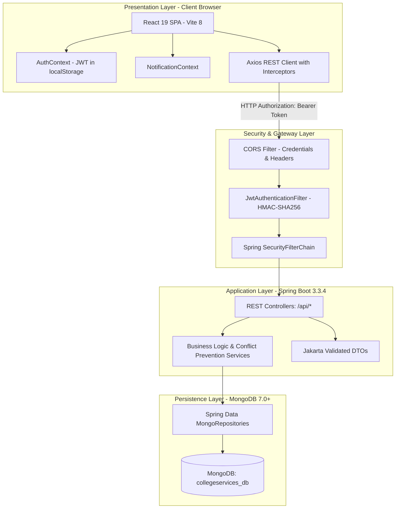
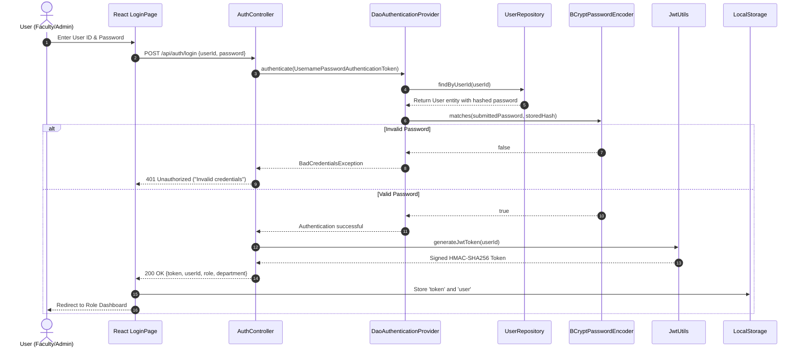
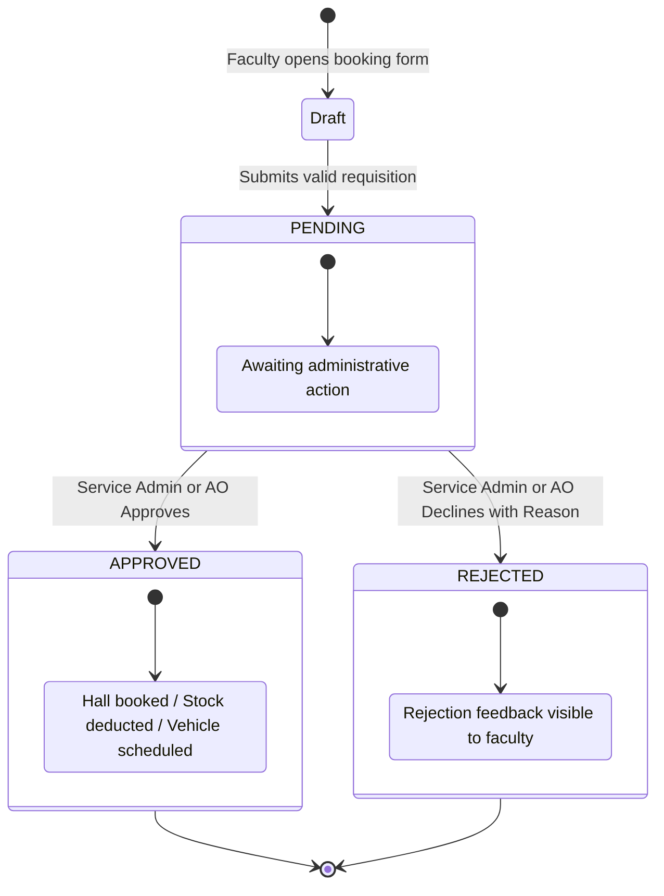
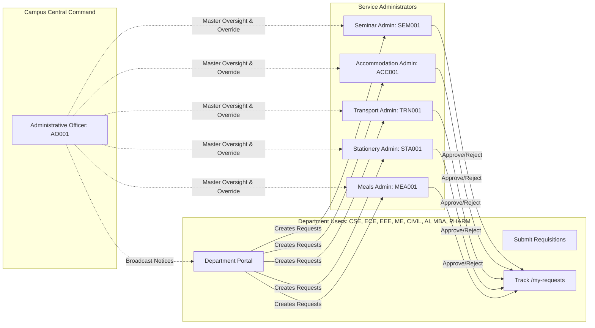
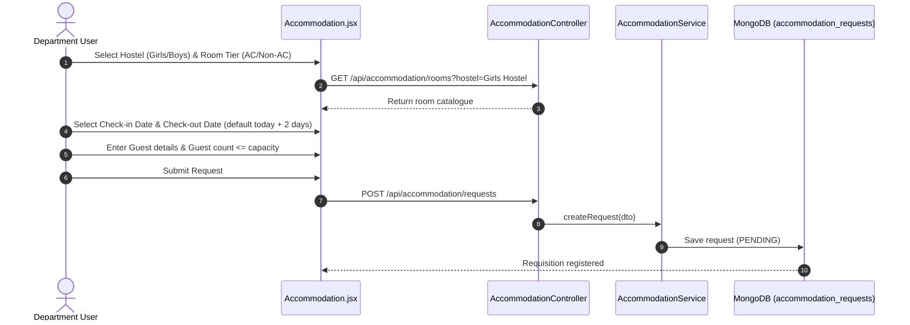
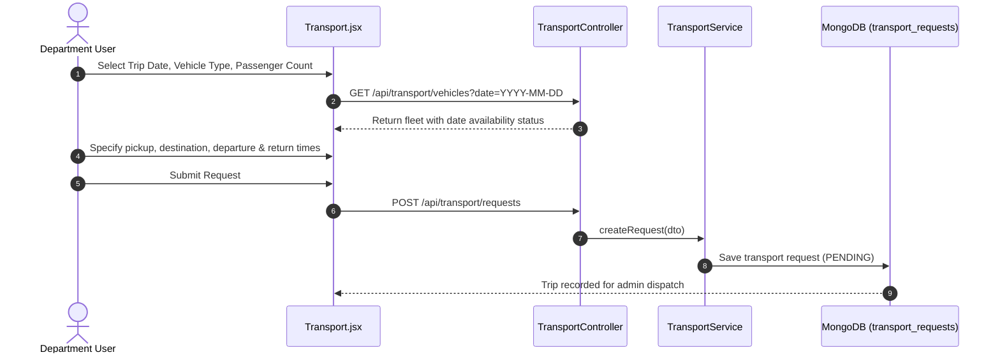
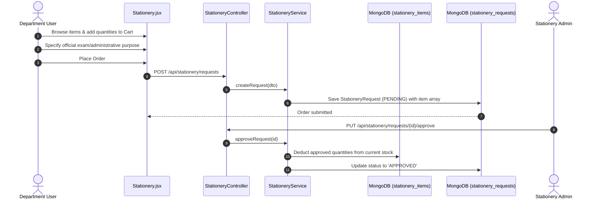
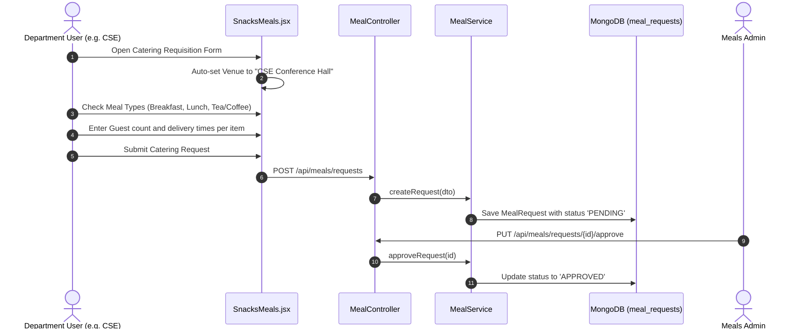

# College Faculty Service Management System — Architecture Diagrams Reference
**Narasaraopet Engineering College (Autonomous)**

This document compiles the complete architectural, behavioural, and data model diagrams illustrating the system's design.

---

## 1. Overall System Architecture
Illustrates the 3-tier stateless client-server model across React, Spring Boot, and MongoDB.



---

## 2. Authentication & Token Verification Flow
Depicts credential submission, BCrypt validation, JWT generation, and client session storage.



---

## 3. Universal Request Lifecycle
Traces the status transitions from departmental submission to administrative resolution.



---

## 4. Role-Based Authorization & Boundary Map
Shows the boundaries between Department Users, Domain Admins, and the AO Super Admin.



---

## 5. Seminar Hall Booking Flow
Illustrates client selection, slot conflict checking via compound index, and approval.

```mermaid
sequenceDiagram
    autonumber
    actor Faculty as Department User
    participant Form as SeminarBooking.jsx
    participant API as SeminarController
    participant Svc as SeminarService
    participant DB as MongoDB (seminar_bookings)
    actor Admin as Seminar Admin (SEM001)

    Faculty->>Form: Select Hall, Date, Slot, and Title
    Form->>API: GET /api/seminar/availability?hallId=SH-1&date=2026-09-26
    API->>Svc: getAvailability(hallId, date)
    Svc->>DB: Query compound index {hallId, date, slot}
    DB-->>Svc: Return booked slots
    Svc-->>API-->>Form: Return available slots list
    Faculty->>Form: Submit Requisition
    Form->>API: POST /api/seminar/requests
    API->>Svc: createBooking(dto)
    Svc->>DB: Save booking with status 'PENDING'
    DB-->>Svc-->>API-->>Form: Booking confirmed (PENDING)
    Admin->>API: PUT /api/seminar/requests/{id}/approve
    API->>Svc: approveBooking(id)
    Svc->>DB: Update status to 'APPROVED'
    Svc-->>Faculty: Dispatch in-app notification
```

---

## 6. Guest House Accommodation Booking Flow
Shows room selection, check-in/out date calculation, and room reservation.



---

## 7. Institutional Transport Requisition Flow
Details vehicle selection, schedule validation, and fleet dispatch.



---

## 8. Departmental Stationery Order Flow
Shows cart assembly, multi-item ordering, and atomic inventory reduction upon approval.



---

## 9. Snacks & Meals Catering Flow
Depicts dynamic venue resolution (`${user.department} Conference Hall`) and meal category breakdown.



---

## 10. Database Entity-Relationship Diagram (Document Models)
Presents all primary document structures and relational references in `collegeservices_db`.

```mermaid
erDiagram
    users {
        string id PK
        string userId UK "e.g. CSE001, AO001"
        string password "BCrypt Salted Hash"
        string name
        string role "DEPARTMENT_USER, AO_ADMIN, etc."
        string department "CSE, ECE, ADMIN, etc."
        string email
        string phone
        date createdAt
    }

    seminar_bookings {
        string id PK
        string bookingId UK "e.g. SH-021"
        string department
        string eventTitle
        string date "YYYY-MM-DD"
        string hallId FK "SH-1, SH-2, etc."
        string hallName
        string slot "FORENOON, AFTERNOON, FULL_DAY"
        string status "PENDING, APPROVED, REJECTED"
        string requestedBy
        string rejectionReason
        int expectedParticipants
    }

    accommodation_requests {
        string id PK
        string requestId UK "e.g. AC-015"
        string department
        string hostel "Girls Hostel / Boys Hostel"
        string roomType "AC Room / Non-AC Room"
        string roomId FK "e.g. GH-AC-1"
        string checkInDate "YYYY-MM-DD"
        string checkOutDate "YYYY-MM-DD"
        int guestsCount
        string facultyOrGuestName
        string status "PENDING, APPROVED, REJECTED"
    }

    transport_requests {
        string id PK
        string requestId UK "e.g. TR-021"
        string department
        string tripType "College Bus, Mini Bus, etc."
        string tripDate "YYYY-MM-DD"
        string vehicleId FK "V-01, V-02, etc."
        string departureTime
        string returnTime
        int expectedPassengers
        string status "PENDING, APPROVED, REJECTED"
    }

    stationery_requests {
        string id PK
        string requestId UK "e.g. ST-014"
        string department
        list itemsRequested "Array of {itemId, quantity}"
        string purpose
        string status "PENDING, APPROVED, REJECTED"
    }

    meal_requests {
        string id PK
        string requestId UK "e.g. SM-018"
        string department
        string eventTitle
        string date "YYYY-MM-DD"
        string venue "e.g. CSE Conference Hall"
        list mealTypes "Breakfast, Lunch, etc."
        list mealItems "Array of {mealType, guestCount}"
        int totalGuests
        string status "PENDING, APPROVED, REJECTED"
    }

    announcements {
        string id PK
        string title
        string content
        string type "EVENT, MAINTENANCE, EXAM, URGENT"
        string date
        boolean active
    }

    notifications {
        string id PK
        string recipientRole
        string recipientDept
        string recipientUserId
        string title
        string message
        string service
        boolean read
        date createdAt
    }

    users ||--o{ seminar_bookings : creates
    users ||--o{ accommodation_requests : creates
    users ||--o{ transport_requests : creates
    users ||--o{ stationery_requests : creates
    users ||--o{ meal_requests : creates
    users ||--o{ notifications : receives
```


