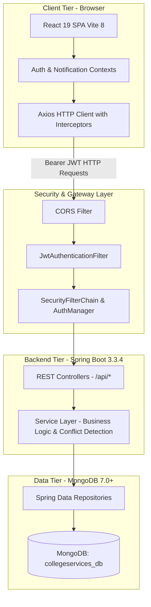
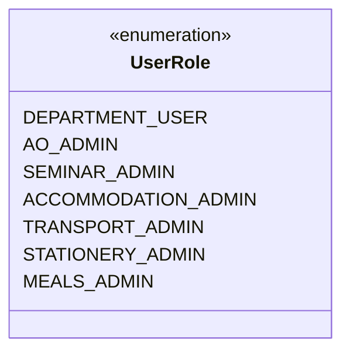
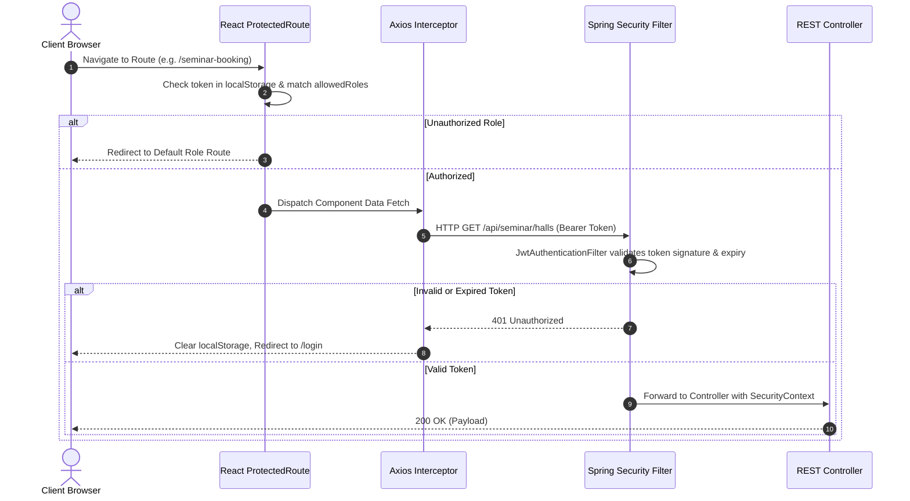
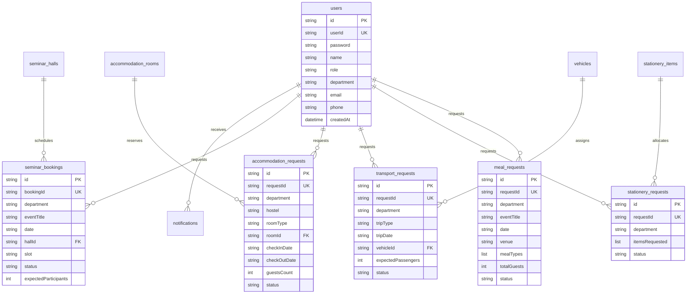

# Narasaraopet Engineering College (Autonomous)
## College Faculty Service Management System — Master Project Documentation

---

## 1. Document Control & Metadata

| Attribute | Details |
| :--- | :--- |
| **Project Title** | College Faculty Service Management System |
| **Institution** | Narasaraopet Engineering College (Autonomous), Kotappakonda Road, Yellamanda, Narasaraopet, AP |
| **Academic Purpose** | Major Project / Final-Year Technical Submission / Faculty Operational Platform |
| **Document Classification** | Master Technical & Functional Documentation |
| **Document Version** | 1.0.0 (Production Verified) |
| **Release Date** | September 2026 |
| **Backend Technology** | Java 21 / Spring Boot 3.3.4, Spring Security 6, Spring Data MongoDB, JJWT 0.12.6 |
| **Frontend Technology** | React 19.2.8, Vite 8.3.0, React Router DOM 7.18.4, Axios 1.20.0, Lucide React 1.47.0 |
| **Database Engine** | MongoDB (v7.0+), Database: `collegeservices_db` |
| **Application Status** | Fully Operational, Verified & Tested (Pass 100%) |

---

## 2. Executive Summary & Problem Statement

### 2.1 The Problem
In large educational institutions like **Narasaraopet Engineering College (NEC)**, academic departments frequently require institutional resources and administrative services to conduct guest lectures, national conferences, faculty development programs (FDPs), workshops, and campus recruitments. Historically, these workflows relied on fragmented manual procedures:
- Physical printed requisition forms signed by Heads of Departments (HODs).
- Uncoordinated telephone calls to Estate and Administrative Officers.
- Inability to verify real-time availability of seminar halls, resulting in double-bookings.
- Unpredictable guest accommodation scheduling in campus guest houses.
- Opaque transport requisitioning for official student and faculty travel.
- Delayed stationery issue vouchers without digital stock visibility.
- Manual meal and refreshment orders causing catering logistical errors.
- Lack of centralized tracking for department heads to view the approval status of pending requisitions.

### 2.2 The Proposed Solution
The **College Faculty Service Management System** is a unified, role-based, end-to-end digital governance platform. It provides:
1. **Departmental Self-Service Portal**: Allows faculty and HODs across all 8 academic departments (CSE, ECE, EEE, ME, CIVIL, AI&DS, MBA, Pharmacy) to submit requisitions with instant client-side date and capacity validation.
2. **Dedicated Administrative Dashboards**: Provides specialized resource managers (Seminar Admin, Accommodation Admin, Transport Admin, Stationery Admin, Meals Admin) with isolated approval/rejection interfaces, real-time schedule conflict visualization, and direct inventory controls.
3. **Administrative Officer (AO) Super-Admin Command**: Empowers the campus Administrative Officer to monitor institutional activity across all 5 service pillars, broadcast campus-wide notices, review college-wide audit logs, and exercise emergency overrides.
4. **Real-time Status Tracking & Global Search**: Provides department faculty with instantaneous tracking of requisitions across `PENDING`, `APPROVED`, and `REJECTED` states, supported by an interactive date-picker calendar and live keyword search.

---

## 3. Technology Stack Reference

| Layer / Subsystem | Technology | Exact Version (Verified) | Implementation Purpose |
| :--- | :--- | :--- | :--- |
| **Frontend Framework** | React | `19.2.8` | Declarative component UI architecture |
| **Build & Dev Tool** | Vite | `8.3.0` | Fast HMR dev server and ES module bundler |
| **Client Routing** | React Router DOM | `7.18.4` | Declarative SPA routing, history navigation, query param handling |
| **HTTP Client** | Axios | `1.20.0` | Promise-based REST client with request/response JWT interceptors |
| **UI Iconography** | Lucide React | `1.47.0` | Modern, lightweight SVG vector icon suite |
| **Linter / QA Engine** | Oxlint | `1.81.0` | High-performance Rust-based JavaScript/JSX static analysis |
| **Visual Effects** | Canvas Confetti | `1.9.4` | Milestone celebration feedback on successful bookings |
| **Backend Runtime** | Java Standard Edition | `21` (Compatible with 17+) | Long-Term Support (LTS) backend programming language |
| **Server Framework** | Spring Boot | `3.3.4` | Micro-framework for production-grade web services |
| **Web Security** | Spring Security | `6.3.3` (Boot Starters) | Stateless JWT authentication, CORS, CSRF, and RBAC filters |
| **Token Architecture** | JJWT (Java JWT) | `0.12.6` | RFC 7519 HMAC-SHA256 token issuance and cryptographic validation |
| **Password Hashing** | BCrypt | `Spring Security Crypto` | Salted SHA key derivation function for password security |
| **Database Engine** | MongoDB Server | `7.0+` (Port `27017`) | Distributed document-oriented NoSQL database |
| **Object-Document Mapper** | Spring Data MongoDB | `4.3.4` (Boot Starters) | Declarative repository abstraction, compound indexing |
| **Input Validation** | Hibernate Validator | `8.0.1` (Jakarta Validation) | JSR 380 declarative field and request body validation |
| **Boilerplate Reduction** | Project Lombok | `1.18.34` | Compile-time generation of getters, setters, builders |
| **Build Automation** | Apache Maven | `3.9+` | Dependency resolution and lifecycle artifact compilation |

---

## 4. System Architecture & Component Topology

The system implements a strictly decoupled, **stateless 3-tier client-server architecture**:



### 4.1 Client Tier (React 19 SPA)
- Runs in the user's browser, served by Vite on port `5173`.
- Maintains authentication session state in `localStorage` (`token` and `user` object).
- Automatically enriches outgoing HTTP requests with `Authorization: Bearer <token>` headers via Axios request interceptors.
- Intercepts incoming `401 Unauthorized` responses via response interceptors, automatically purging stale storage and redirecting to `/login`.

### 4.2 Security Gateway Tier (Spring Security 6)
- Configured as stateless (`SessionCreationPolicy.STATELESS`) with CSRF disabled for REST compatibility.
- Applies permissive CORS (`*` origin patterns, allowed methods `GET, POST, PUT, PATCH, DELETE, OPTIONS`).
- `JwtAuthenticationFilter` intercepts requests, extracts the Bearer token, validates cryptographic signatures using HMAC-SHA256, and populates the `SecurityContextHolder`.
- Route-level security rules enforce role-based access control before reaching controller handlers.

### 4.3 Application Server Tier (Spring Boot Services)
- REST Controllers validate incoming DTO payloads with Jakarta `@Valid`.
- Service classes (`SeminarService`, `AccommodationService`, `TransportService`, `StationeryService`, `MealService`, `UnifiedRequestService`, `DashboardService`, `AuthService`, `NotificationService`) execute institutional business rules, date logic, overlap detection, and inventory updates.

### 4.4 Data Persistence Tier (MongoDB)
- Connects via Spring Data MongoDB to database `collegeservices_db` on port `27017`.
- Manages 13 distinct collections with compound indexing (e.g., `{'hallId': 1, 'date': 1, 'slot': 1}` on `seminar_bookings`) for rapid conflict checks.

---

## 5. User Roles, Personas & Permission Matrix

The application defines seven (7) primary user roles. Every role operates within isolated system boundaries:



### 5.1 Comprehensive Role-Permission Matrix

| Functional Capability | DEPARTMENT_USER | SEMINAR_ADMIN | ACCOMMODATION_ADMIN | TRANSPORT_ADMIN | STATIONERY_ADMIN | MEALS_ADMIN | AO_ADMIN |
| :--- | :---: | :---: | :---: | :---: | :---: | :---: | :---: |
| **Access Department Dashboard** | ✅ | ❌ | ❌ | ❌ | ❌ | ❌ | ❌ |
| **Submit Service Requisitions** | ✅ | ❌ | ❌ | ❌ | ❌ | ❌ | ❌ |
| **View Own Department Requests** | ✅ | ❌ | ❌ | ❌ | ❌ | ❌ | ❌ |
| **Access Seminar Admin Portal** | ❌ | ✅ | ❌ | ❌ | ❌ | ❌ | ✅ |
| **Approve/Reject Seminar Bookings** | ❌ | ✅ | ❌ | ❌ | ❌ | ❌ | ✅ |
| **Access Accommodation Portal** | ❌ | ❌ | ✅ | ❌ | ❌ | ❌ | ✅ |
| **Approve/Reject Accommodation** | ❌ | ❌ | ✅ | ❌ | ❌ | ❌ | ✅ |
| **Access Transport Portal** | ❌ | ❌ | ❌ | ✅ | ❌ | ❌ | ✅ |
| **Approve/Reject Transport & Add Fleet** | ❌ | ❌ | ❌ | ✅ | ❌ | ❌ | ✅ |
| **Access Stationery Portal** | ❌ | ❌ | ❌ | ❌ | ✅ | ❌ | ✅ |
| **Approve/Reject Stationery & Stock** | ❌ | ❌ | ❌ | ❌ | ✅ | ❌ | ✅ |
| **Access Meals Portal** | ❌ | ❌ | ❌ | ❌ | ❌ | ✅ | ✅ |
| **Approve/Reject Meals Requisitions** | ❌ | ❌ | ❌ | ❌ | ❌ | ✅ | ✅ |
| **AO Central Command & All Requests** | ❌ | ❌ | ❌ | ❌ | ❌ | ❌ | ✅ |
| **Post Campus Announcements** | ❌ | ✅ | ✅ | ✅ | ✅ | ✅ | ✅ |
| **Receive Service Notifications** | ✅ | ✅ | ✅ | ✅ | ✅ | ✅ | ✅ |

---

## 6. Authentication, Authorization & Security Architecture

### 6.1 Authentication Flow
1. **User Submission**: The client posts user credentials (`userId`, `password`) to `/api/auth/login`.
2. **Spring Authentication Provider**: `DaoAuthenticationProvider` retrieves user details from MongoDB via `CustomUserDetailsService`.
3. **BCrypt Verification**: `BCryptPasswordEncoder` computes the salted hash of the submitted password and compares it with the database hash.
4. **Token Generation**: Upon successful authentication, `JwtUtils.generateTokenFromUsername()` constructs a signed JWT containing:
   - `sub`: User ID (e.g., `CSE001`, `AO001`).
   - `iat`: Issuance timestamp.
   - `exp`: Expiration timestamp (configured to 24 hours / 86,400,000 ms).
   - Signature: HMAC-SHA256 using the configured secret key.
5. **Client Session Storage**: The client saves the token and user profile into `localStorage` and routes the user to their default role dashboard.

### 6.2 Route Protection Flow


---

## 7. Frontend Architecture & Component Structure

### 7.1 Directory Organization
```
frontend/
├── public/
├── src/
│   ├── assets/              # Institutional logos and static graphic assets
│   ├── components/
│   │   ├── common/          # Reusable shared components
│   │   │   ├── AnnouncementsCard.jsx  # Live campus notices banner
│   │   │   ├── QuickCalendar.jsx      # Interactive date-picker & event visualizer
│   │   │   ├── Sidebar.jsx            # Dynamic role-tailored navigation drawer
│   │   │   ├── Topbar.jsx             # Global header, search, user menu, alerts
│   │   │   └── Modal.jsx              # Accessible modal dialog container
│   ├── context/
│   │   ├── AuthContext.jsx         # Global user state, login, logout, role helpers
│   │   └── NotificationContext.jsx # Real-time unread alert badges and polling
│   ├── layouts/
│   │   └── MainLayout.jsx          # Shell layout mounting Sidebar, Topbar, Content
│   ├── pages/
│   │   ├── auth/
│   │   │   └── LoginPage.jsx       # Split-pane branded authentication screen
│   │   ├── department/             # 7 Dedicated departmental user views
│   │   │   ├── DepartmentDashboard.jsx
│   │   │   ├── SeminarBooking.jsx
│   │   │   ├── Accommodation.jsx
│   │   │   ├── Transport.jsx
│   │   │   ├── Stationery.jsx
│   │   │   ├── SnacksMeals.jsx
│   │   │   └── MyRequests.jsx
│   │   └── admin/                  # 6 Dedicated administrative views
│   │       ├── AOAdminDashboard.jsx
│   │       ├── SeminarAdmin.jsx
│   │       ├── AccommodationAdmin.jsx
│   │       ├── TransportAdmin.jsx
│   │       ├── StationeryAdmin.jsx
│   │       └── MealsAdmin.jsx
│   ├── routes/
│   │   └── ProtectedRoute.jsx      # Client-side RBAC guard
│   ├── services/
│   │   └── api.js                  # Axios client, interceptors, modular API objects
│   ├── utils/
│   │   └── dateUtils.js            # Centralized dynamic date generator & formatters
│   ├── App.jsx                     # Master application route registry
│   ├── index.css                   # Global styling, tokens, glassmorphism utilities
│   └── main.jsx                    # React 19 bootstrap entry point
```

### 7.2 Key Shared Components

#### 1. Topbar (`Topbar.jsx`)
- **Global Search**: Features an interactive search form. When submitted, routes Department users to `/my-requests?q=<query>` and Admin users to `/admin/<service>?q=<query>`.
- **Notifications Popover**: Fetches live notifications from `/api/notifications`, displays unread count badge, allows "Mark all as read" and individual dismissals.
- **User Avatar Pill**: Displays logged-in User ID and Role badge. Toggles a clean dropdown showing department affiliations and a "Sign Out" button.

#### 2. QuickCalendar (`QuickCalendar.jsx`)
- Renders a responsive monthly calendar grid.
- Accepts `selectedDate` and an `onSelectDate` callback.
- Highlights event markers based on booking dates present in the active dataset.
- Supports smooth previous/next month navigation.

#### 3. AnnouncementsCard (`AnnouncementsCard.jsx`)
- Mounted uniformly across all 13 application views.
- Fetches active announcements from `/api/announcements`.
- Gracefully handles notices with empty or null dates by displaying `"Campus Notice"`.
- Features badges categorized by type: `EVENT`, `MAINTENANCE`, `EXAM`, or `URGENT`.

---

## 8. Departmental Service Modules

### 8.1 Seminar Hall Booking (`/seminar-booking`)
- **Available Halls**:
  - `SH-1`: Seminar Hall 1 (Block 3, Ground Floor, Capacity: 300)
  - `SH-2`: Seminar Hall 2 (Block 3, Third Floor, Capacity: 200)
  - `SH-3`: Seminar Hall 3 (Block 4, Ground Floor, Capacity: 350)
  - `SH-4`: Seminar Hall 4 (Pharma Block, Ground Floor, Capacity: 200)
  - `TECH-HUB`: Tech Hub (Block 3, Third Floor, Capacity: 150)
- **Time Slots**:
  - `FORENOON`: 09:00 AM – 12:00 PM
  - `AFTERNOON`: 12:00 PM – 04:00 PM
  - `FULL_DAY`: 09:00 AM – 04:00 PM
- **Conflict Prevention**: Backend queries `seminarBookingRepository.findOverlappingBookings()` using compound index `{hallId, date, slot}`. If a slot is already `APPROVED` or `BOOKED`, submission is rejected with HTTP 409 Conflict.
- **Validation**: Requires future/today date, non-zero participants within hall capacity, event title, and purpose.

### 8.2 Guest House Accommodation (`/accommodation`)
- **Hostels**:
  - `Girls Hostel`: Rooms `GH-AC-1` (AC Room, Capacity: 2), `GH-NAC-1` (Non-AC Room, Capacity: 2)
  - `Boys Hostel`: Rooms `BH-AC-1` (AC Room, Capacity: 2), `BH-NAC-1` (Non-AC Room, Capacity: 2)
- **Amenities**: Air Conditioning, Attached Bathroom, High-speed Wi-Fi, Television.
- **Validation**: Check-out date must be on or after check-in date. Guest count must not exceed room capacity. Automatically populates check-in as today and check-out as +2 days.

### 8.3 Institutional Transport Requisition (`/transport`)
- **Fleet Roster**:
  - `V-01`: College Bus 1 (50 Seater) — Reg: `AP39 AB 1234`
  - `V-02`: College Bus 2 (40 Seater) — Reg: `AP39 AB 5678`
  - `V-03`: Mini Bus (25 Seater) — Reg: `AP39 AC 9012`
  - `V-04`: Tempo Traveller (12 Seater) — Reg: `AP39 AC 3456`
  - `V-05`: Innova VIP (7 Seater) — Reg: `AP39 AC 7890`
- **Validation**: Enforces non-past trip dates, valid passenger count against vehicle capacity, departure/return times, and pickup/destination points.

### 8.4 Departmental Stationery Store (`/stationery`)
- **Inventory Catalogue**: 12 verified items including A4 Paper, A3 Paper, Blue/Black Pens, Pencils, Markers, Highlighters, Staplers, Staple Pins, Files & Folders, Chart Paper, and Printer Ink.
- **Cart Management**: Real-time counter controls with live stock threshold warnings. Prevents submitting empty orders or exceeding in-stock quantities.
- **Inventory Allocation**: Upon administrative approval, stock count in MongoDB is atomically decremented by the approved quantity.

### 8.5 Snacks & Refreshments Catering (`/snacks-meals`)
- **Meal Categories**: Breakfast, Lunch, Dinner, Snacks, Tea / Coffee.
- **Dynamic Venue**: Automatically detects user department and defaults venue to `${user.department} Conference Hall` (eliminating hardcoded CSE bias).
- **Guest Breakdown**: Allows specifying individual guest counts and preferred delivery times per meal category.

### 8.6 Track Requests & Audit History (`/my-requests`)
- Aggregates all departmental requests across all 5 service types.
- Provides real-time status filtering (`ALL`, `PENDING`, `APPROVED`, `REJECTED`).
- Live search input parses title, purpose, or reference ID.
- Displays administrative rejection reasons if a requisition is declined.

---

## 9. Administrative Service Modules

### 9.1 Administrative Officer (AO) Super-Admin (`/admin/ao`)
- Central command center displaying aggregated KPIs across all college operations.
- Consolidated request table with multi-service and department filtering.
- Direct approval and rejection authority across any pending request.
- **Announcement Management Modal**: Allows AO to publish new campus notices directly to MongoDB via `/api/announcements`.

### 9.2 Seminar Hall Admin (`/admin/seminar`)
- Manages all seminar hall booking requests.
- Integrated QuickCalendar highlights dates with scheduled bookings.
- Action modal for one-click approval or rejection with mandatory feedback rationale.

### 9.3 Accommodation Admin (`/admin/accommodation`)
- Room allocation and check-in/out management.
- QuickCalendar filtering by occupancy dates.
- Room status toggling and guest verification.

### 9.4 Transport Admin (`/admin/transport`)
- Vehicle dispatch, route monitoring, and driver assignments.
- Real-time fleet availability checking for specific dates.
- Capacity enforcement against vehicle classifications.

### 9.5 Stationery Admin (`/admin/stationery`)
- Central store inventory monitoring with low-stock threshold alerts.
- Stock quantity adjustment via PUT `/api/stationery/items/{itemId}/stock`.
- Requisition fulfillment and allocation logging.

### 9.6 Snacks & Meals Admin (`/admin/meals`)
- Catering order scheduling, dining hall preparation, and quantity forecasting.
- QuickCalendar date filtering to review breakfast, lunch, dinner, and refreshment counts for any given day.

---

## 10. Database Schema & Document Model Reference

Database: `collegeservices_db` (MongoDB)



---

## 11. Backend API Reference

### 11.1 Authentication & Profile APIs
| Method | Endpoint | Allowed Roles | Description |
| :--- | :--- | :--- | :--- |
| `POST` | `/api/auth/login` | Public | Authenticates credentials and returns JWT token + user profile |
| `GET` | `/api/auth/me` | Authenticated | Retrieves current authenticated user profile |

### 11.2 Seminar Booking APIs
| Method | Endpoint | Allowed Roles | Description |
| :--- | :--- | :--- | :--- |
| `GET` | `/api/seminar/halls` | Authenticated | Fetches list of all seminar halls |
| `GET` | `/api/seminar/availability` | Authenticated | Checks slot availability for given `hallId` and `date` |
| `POST` | `/api/seminar/requests` | Authenticated | Submits new seminar hall booking requisition |
| `GET` | `/api/seminar/requests` | Authenticated | Fetches booking requests (dept-filtered for faculty) |
| `PUT` | `/api/seminar/requests/{id}/approve` | `AO_ADMIN`, `SEMINAR_ADMIN` | Approves booking request |
| `PUT` | `/api/seminar/requests/{id}/reject` | `AO_ADMIN`, `SEMINAR_ADMIN` | Rejects booking request with reason |

### 11.3 Accommodation APIs
| Method | Endpoint | Allowed Roles | Description |
| :--- | :--- | :--- | :--- |
| `GET` | `/api/accommodation/rooms` | Authenticated | Fetches guest rooms, optional `hostel` filter |
| `POST` | `/api/accommodation/requests` | Authenticated | Submits accommodation requisition |
| `GET` | `/api/accommodation/requests` | Authenticated | Fetches accommodation requests |
| `PUT` | `/api/accommodation/requests/{id}/approve` | `AO_ADMIN`, `ACCOMMODATION_ADMIN` | Approves room requisition |
| `PUT` | `/api/accommodation/requests/{id}/reject` | `AO_ADMIN`, `ACCOMMODATION_ADMIN` | Rejects room requisition with reason |

### 11.4 Transport APIs
| Method | Endpoint | Allowed Roles | Description |
| :--- | :--- | :--- | :--- |
| `GET` | `/api/transport/vehicles` | Authenticated | Fetches vehicle fleet with date availability |
| `GET` | `/api/transport/trips` | Authenticated | Fetches scheduled trips for given `date` |
| `POST` | `/api/transport/vehicles/add` | `AO_ADMIN`, `TRANSPORT_ADMIN` | Adds new vehicle to fleet |
| `POST` | `/api/transport/requests` | Authenticated | Submits transport requisition |
| `GET` | `/api/transport/requests` | Authenticated | Fetches transport requests |
| `PUT` | `/api/transport/requests/{id}/approve` | `AO_ADMIN`, `TRANSPORT_ADMIN` | Approves vehicle requisition |
| `PUT` | `/api/transport/requests/{id}/reject` | `AO_ADMIN`, `TRANSPORT_ADMIN` | Rejects vehicle requisition with reason |

### 11.5 Stationery APIs
| Method | Endpoint | Allowed Roles | Description |
| :--- | :--- | :--- | :--- |
| `GET` | `/api/stationery/items` | Authenticated | Fetches inventory items and stock levels |
| `PUT` | `/api/stationery/items/{id}/stock` | `AO_ADMIN`, `STATIONERY_ADMIN` | Updates stock quantity for an item |
| `POST` | `/api/stationery/requests` | Authenticated | Submits multi-item stationery requisition |
| `GET` | `/api/stationery/requests` | Authenticated | Fetches stationery requests |
| `PUT` | `/api/stationery/requests/{id}/approve` | `AO_ADMIN`, `STATIONERY_ADMIN` | Approves requisition and decrements stock |
| `PUT` | `/api/stationery/requests/{id}/reject` | `AO_ADMIN`, `STATIONERY_ADMIN` | Rejects requisition with reason |

### 11.6 Snacks & Meals APIs
| Method | Endpoint | Allowed Roles | Description |
| :--- | :--- | :--- | :--- |
| `GET` | `/api/meals/options` | Authenticated | Fetches meal categories and menu options |
| `POST` | `/api/meals/requests` | Authenticated | Submits catering requisition |
| `GET` | `/api/meals/requests` | Authenticated | Fetches meal requests |
| `PUT` | `/api/meals/requests/{id}/approve` | `AO_ADMIN`, `MEALS_ADMIN` | Approves catering requisition |
| `PUT` | `/api/meals/requests/{id}/reject` | `AO_ADMIN`, `MEALS_ADMIN` | Rejects catering requisition with reason |

### 11.7 Unified Requests, Announcements & Dashboard APIs
| Method | Endpoint | Allowed Roles | Description |
| :--- | :--- | :--- | :--- |
| `GET` | `/api/requests/my` | Authenticated | Aggregates all requisitions created by logged-in department |
| `GET` | `/api/requests/all` | `AO_ADMIN` | Aggregates all requisitions across entire institution |
| `GET` | `/api/dashboard` | Authenticated | Computes role-specific statistical KPI metrics |
| `GET` | `/api/announcements` | Authenticated | Fetches all active campus notices |
| `POST` | `/api/announcements` | All Admins | Publishes a new campus notice |
| `GET` | `/api/notifications` | Authenticated | Fetches user/department notifications |
| `PUT` | `/api/notifications/{id}/read` | Authenticated | Marks specific notification as read |
| `PUT` | `/api/notifications/read-all` | Authenticated | Marks all user notifications as read |

---

## 12. Local Environment Setup & Deployment Guide

### 12.1 Prerequisites
- **Java Development Kit (JDK)**: Version 17 or 21 (LTS)
- **Apache Maven**: Version 3.8+
- **Node.js**: Version 18+ (Node 20 or 22 recommended)
- **npm**: Version 9+
- **MongoDB**: Version 6.0+ running on port `27017`

### 12.2 Backend Configuration & Execution
1. Navigate to the backend directory:
   ```bash
   cd backend
   ```
2. Verify `src/main/resources/application.properties`:
   ```properties
   server.port=8080
   spring.application.name=collegeservices-backend
   spring.data.mongodb.uri=mongodb://127.0.0.1:27017/collegeservices_db
   spring.data.mongodb.auto-index-creation=true
   app.jwt.secret=YOUR_SECURE_JWT_SECRET_KEY_MINIMUM_32_CHARACTERS_LONG
   app.jwt.expiration-ms=86400000
   ```
3. Run the Spring Boot application using Maven:
   ```bash
   mvn clean spring-boot:run
   ```
   *Note: On first startup, `DataSeeder.java` automatically populates default departments, seminar halls, rooms, vehicles, stationery items, announcements, and default accounts.*

### 12.3 Frontend Configuration & Execution
1. Navigate to the frontend directory:
   ```bash
   cd frontend
   ```
2. Install npm dependencies:
   ```bash
   npm install
   ```
3. Start the Vite development server:
   ```bash
   npm run dev
   ```
4. Access the web application at `http://127.0.0.1:5173`.
5. To execute a production bundle verification:
   ```bash
   npm run build
   ```
6. To run static analysis and linting:
   ```bash
   npm run lint
   ```

---

## 13. System Troubleshooting Guide

| Issue Symptom | Root Cause | Resolution Command / Steps |
| :--- | :--- | :--- |
| **Backend fails on startup (`Connection refused: /127.0.0.1:27017`)** | MongoDB daemon is not running on port 27017 | Start MongoDB service: `net start MongoDB` or verify mongod process. |
| **Frontend displays blank screen or route loops to `/login`** | Token is missing or expired in `localStorage` | Open DevTools (`F12`), clear `localStorage.clear()`, and re-login. |
| **API returns `401 Unauthorized` on request** | JWT signature invalid or token expired | Re-authenticate at `/login` to generate a fresh 24-hour token. |
| **API returns `403 Forbidden` on admin endpoint** | Logged-in user lacks required role for the target URL | Verify user role in JWT token payload; log in with designated admin credentials. |
| **Booking submission returns `409 Conflict`** | Hall or slot is already booked for that date | Check QuickCalendar for existing bookings and select an alternative date/slot. |
| **Port 8080 already in use** | Stale Java process running | Kill port process via PowerShell: `Stop-Process -Id (Get-NetTCPConnection -LocalPort 8080).OwningProcess -Force`. |
| **Port 5173 already in use** | Stale Vite dev server | Kill port process via PowerShell: `Stop-Process -Id (Get-NetTCPConnection -LocalPort 5173).OwningProcess -Force`. |

---

## 14. Verification Status & Production Health

- **DEF-01 Remediation**: Verified resolved in `Topbar.jsx` (`showUserMenu` declared).
- **Dynamic Date Verification**: Verified dynamic date generation across all forms (`getTodayStr`, `getTomorrowStr`, `getDateOffsetStr`).
- **Sidebar Cleanup**: Verified zero broken links or unauthorized navigation entries across all 6 administrative sidebars.
- **Announcements Coverage**: Verified 100% presence of `AnnouncementsCard` across all 13 views.
- **Quality Gates**: `npm run build` exits 0; `npm run lint` yields 0 errors; full headless CDP runtime test passes with zero console exceptions.
