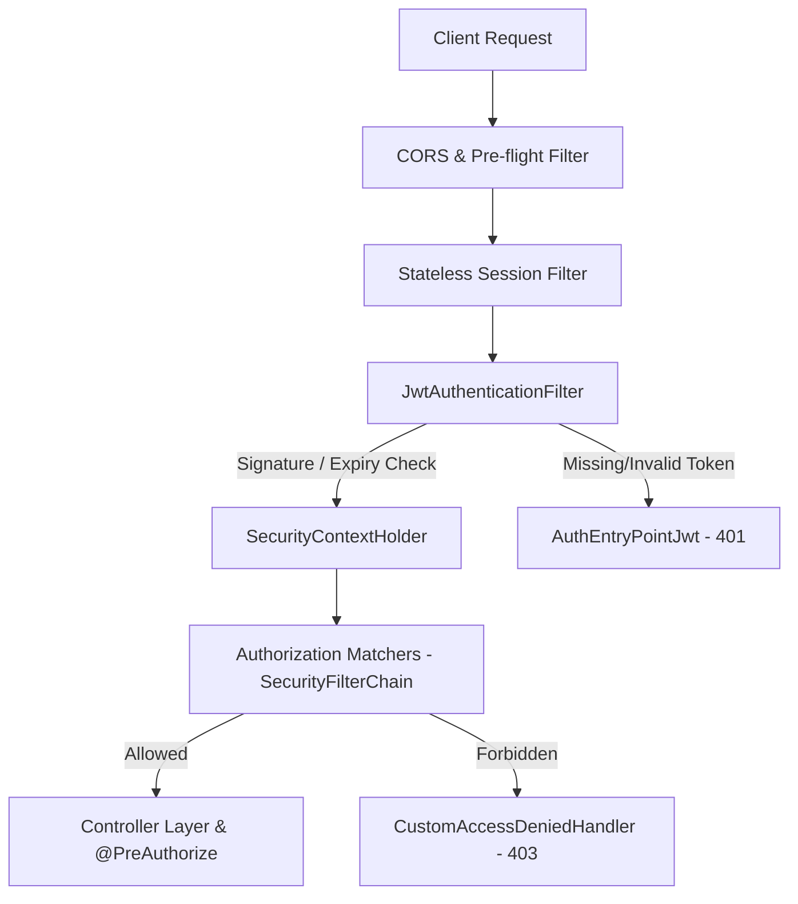

# College Faculty Service Management System — Security Architecture & Hardening Guide
**Narasaraopet Engineering College (Autonomous)**

---

## 1. Security Overview & Philosophy

The **College Faculty Service Management System** is built on a "defense-in-depth" security philosophy. The platform enforces multi-layered controls across network boundaries, transport layers, cryptographic tokens, route guards, and persistence schemas to guarantee data integrity and strict role isolation.



---

## 2. Cryptographic Password Protection (BCrypt)

1. **Algorithm**: Passwords are encrypted using Spring Security's `BCryptPasswordEncoder`.
2. **Work Factor / Salt**: BCrypt incorporates a random 128-bit salt and an iterative work factor ($2^{10}$ rounds by default), making dictionary and precomputed rainbow table attacks computationally infeasible.
3. **Data Protection at Rest**: Passwords stored in MongoDB collection `users` are strictly one-way hashes (`$2a$10$...`).
4. **Data Protection in Transit**: Controller methods explicitly purge the password hash before serializing user records:
   ```java
   user.setPassword(null); // Never return password hash over the wire
   ```

---

## 3. JSON Web Token (JWT) Implementation

The system implements the **RFC 7519 JSON Web Token** standard via the `jjwt` library (`0.12.6`):

### 3.1 Token Characteristics
- **Algorithm**: HMAC-SHA256 (`HS256`).
- **Signature Key**: 256-bit cryptographically secure key defined in `application.properties` (`app.jwt.secret`).
- **Lifespan**: Configured to 24 hours (`86400000 ms`).
- **Token Claims**:
  - `sub`: Unique User ID (e.g. `CSE001`, `AO001`).
  - `iat`: Epoch issuance timestamp.
  - `exp`: Epoch expiration timestamp.

### 3.2 Token Validation Lifecycle
1. The client sends `Authorization: Bearer <token>` in the HTTP request headers.
2. `JwtAuthenticationFilter.doFilterInternal()` extracts the token header.
3. `JwtUtils.validateJwtToken()` checks the cryptographic HMAC signature and ensures the token has not expired.
4. If valid, the filter extracts the username, loads user roles, and attaches an `UsernamePasswordAuthenticationToken` to Spring's `SecurityContextHolder`.

---

## 4. Role-Based Access Control (RBAC) & Boundary Isolation

### 4.1 Departmental Isolation
- Department users belong to the `DEPARTMENT_USER` role with a designated department code (e.g. `CSE`, `ECE`).
- In `RequestController.java`, the `/api/requests/my` endpoint inspects the authenticated user:
  ```java
  User user = authService.getCurrentUser();
  unifiedRequestService.getRequestsForDepartment(user.getDepartment(), service, status, search);
  ```
- Department faculty cannot query, manipulate, or view requisitions from other academic departments.

### 4.2 Service Administrator Isolation
- Each service is managed by a distinct administrative role:
  - `SEMINAR_ADMIN` -> `/api/seminar/requests/*/approve`
  - `ACCOMMODATION_ADMIN` -> `/api/accommodation/requests/*/approve`
  - `TRANSPORT_ADMIN` -> `/api/transport/requests/*/approve`
  - `STATIONERY_ADMIN` -> `/api/stationery/requests/*/approve`
  - `MEALS_ADMIN` -> `/api/meals/requests/*/approve`
- Route rules strictly forbid cross-domain execution (e.g., a Transport Admin attempting to approve a Seminar Hall booking receives `403 Forbidden`).

### 4.3 Administrative Officer (AO) Super-Admin Scope
- The `AO_ADMIN` role holds campus-wide governance authority.
- Can access `/api/requests/all` to review all requisitions across all departments.
- Holds master override capability to approve or reject any requisition across any of the five service pillars.

---

## 5. Network & HTTP Security Configurations

### 5.1 Cross-Origin Resource Sharing (CORS)
- Handled via `CorsConfigurationSource` in `SecurityConfig.java`.
- Allows credentials (`setAllowCredentials(true)`).
- Restricts allowed headers to `Authorization, Content-Type, X-Requested-With, Accept, Origin`.
- Allows standard HTTP methods (`GET, POST, PUT, PATCH, DELETE, OPTIONS`).

### 5.2 Cross-Site Request Forgery (CSRF)
- CSRF protection is explicitly disabled (`csrf.disable()`) because the application uses stateless Bearer JWT authentication stored in client-side memory/`localStorage`, rendering cookie-based CSRF exploits ineffective.

### 5.3 Session Management
- Configured to `SessionCreationPolicy.STATELESS`. Spring Security creates no server-side `HttpSession`, preventing session hijacking and session fixation attacks.

---

## 6. Error & Unauthorized Access Handling

| Scenario | HTTP Code | Handler Class | Client Behavior |
| :--- | :---: | :--- | :--- |
| **Unauthenticated Request / Expired Token** | `401 Unauthorized` | `AuthEntryPointJwt.java` | Axios interceptor clears `localStorage` and redirects to `/login`. |
| **Unauthorized Role Access** | `403 Forbidden` | `CustomAccessDeniedHandler.java` | Displays access denied alert without altering login state. |
| **Input Validation Failure** | `400 Bad Request` | Hibernate Validator | Returns descriptive field-level error messages in JSON. |
| **Schedule Conflict** | `409 Conflict` | Domain Services | Displays error alert informing user of overlapping booking. |

---

## 7. Security Best Practices & Hardening Recommendations

For institutional production deployment:
1. **HTTPS / TLS Encryption**: Deploy backend behind an Nginx or Apache reverse proxy with valid TLS/SSL certificates (e.g. Let's Encrypt or institutional certificate) to encrypt Bearer tokens in transit.
2. **Environment Variable Injection**: Store `app.jwt.secret` and MongoDB credentials in OS environment variables rather than plaintext in `application.properties`.
3. **Database Network Isolation**: Ensure MongoDB port `27017` is bound only to `127.0.0.1` or protected behind an institutional VPC firewall.
4. **Token Revocation (Denylist)**: For instant logout invalidation before the 24-hour expiry, maintain a fast Redis cache storing revoked token identifiers.
